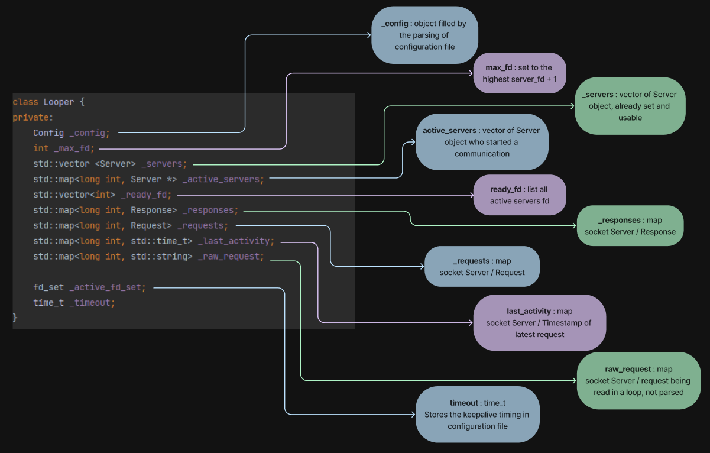
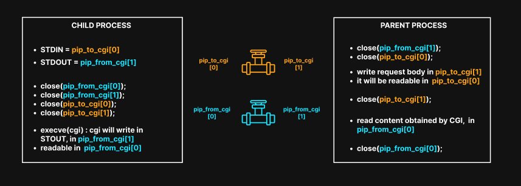

# Webserv CPP98
- [1. Get Started](#get-started)
- [2. Parsing](#parsing)
  - [2.1 Parse Configuration File](#parse-configuration-file)
    - [2.1.1 Configurations values for Server](#configurations-values-for-server)
    - [2.1.2 Configurations values for Locations](#configurations-values-for-locations)
    - [2.1.3 Configurations values for Redirections](#configurations-values-for-redirections)
  - [2.2 Parse HTTP Request](#parse-http-request)
- [3. Execution](#execution)
  - [3.1 Select()](#select)
  - [3.2 Main Loop](#main-loop)
  - [3.3 Looper Object](#looper-object)
- [4. Response](#response)
- [5. HTTP Methods](#http-methods)
- [6. CGI](#cgi)

Made by [Bima](https://github.com/Bima42), [YvanoffP](https://github.com/YvanoffP) and [Tyrossel](https://github.com/tyrossel)

# Get Started
```
make
```

```
./webserv configuration_file.json
```

# Parsing
## Parse Configuration File


- Configuration file must be JSON file
- See how to parse JSON [here](https://www.json.org/json-en.html)

### Configurations values for Server

| Key                  | Type                      | Value                                                               | 
| :--------------      |:-----------------------   |:-----------------------------------------------------------------   |
| address              | STRING                    | IP address on which the server is listening on                      | 
| port                 | INT                       | port on which the server is listening on                            |
| server_name          | STRING or ARRAY           | names used to connect to the server                                 |

### Configurations values for Locations

| Key                  | Type                      | Value                                                               | 
| :--------------      |:-----------------------   |:-----------------------------------------------------------------   |
| root                 | STRING                    | Root path of the server                                             |
| index                | STRING or ARRAY           | names of index files                                                |
| cgi_bin              | STRING                    | path to the cgi exe by default                                      |
| max_client_body_size | INT                       | Max size of body client request                                     |
| auto_index           | BOOL                      | Set the auto_index on or off                                        |
| disabled_methods     | STRING or ARRAY           | Set the disable methods for all server or location                  |
| error_pages          | OBJECT - String:INT ARRAY | path to custom error pages:errors code                              |
| cgi_extensions       | ARRAY                     | Files extensions where CGI will be executed                         |
| locations            | ARRAY of OBJECT           | each location is a mini server, where some configuration can change |
| location_path        | STRING                    | Set the disable methods for all server or location                  |

### Configurations values for Redirections

| Key                  | Type                      | Value                                                               | 
| :--------------      |:-----------------------   |:-----------------------------------------------------------------   |
| redirections         | ARRAY of OBJECT           | each objects contains old_url, status and can have new_url          |
| old_url              | STRING                    | old url you want redirect                                           |
| new_url              | STRING                    | new url who old url will be redirected on                           |
| status               | INT                       | status link to the redirection                                      |

- First part of configuration is server by default == location by default
- Each locations are considered as little server
- Only `address, port and server_names` cannot be redefined in a location
- If a configuration is not present in a location, this configuration key will take the default value in default location

## Parse HTTP Request

- Client request is store in Request object


- Payload body accepted in our server :
  - classic payload
  - chunked without trailer
  - chunked with payload


# Execution

## Select()


- allow your program to monitor multiple file descriptor (max 1024)
- will be waiting for _timeout_ and return a value :
  - -1 : error
  - 0 : if timeout
  - > 0 : total number of bits that are set in readfds, writefds and exceptfds

## Main Loop
- Here is the main


- When select() returns a value > 0, 3 others loop are called


## Looper Object

- Looper is the main object
- He stores all objects required to get the client request, parse it and build a response to him




# Response
- String, must be sent to the client
- Use the socket to communicate with him
- Response should be write with strict semantic


# HTTP Methods

| Method          | Body                      | Resume                                                                                | 
| :-------------- |:-----------------------   |:------------------------------------------------------------                          |
| GET             | No                        | requests a representation of the specified resource                                   |
| POST            | Yes                       | sends data to the server, sent via an HTML form and results in a change on the server |
| DELETE          | May.                      | deletes the specified resource                                                        |

# CGI
- Common Gateway Interface
- Interface that enables servers to execute an extern program
- Use to process user requests, often when user submits a web form that use CGI
- Server will transmit the request to the script, and sent back the CGI response
- Communication between server and CGI will be made using pipe



- Here is a simple resume of CGI process


