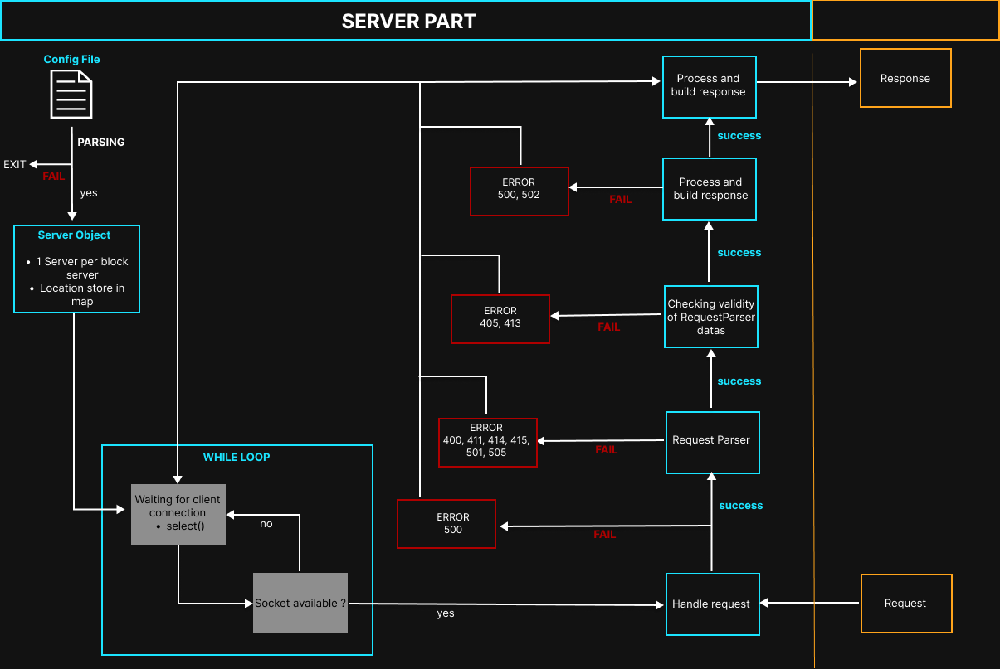
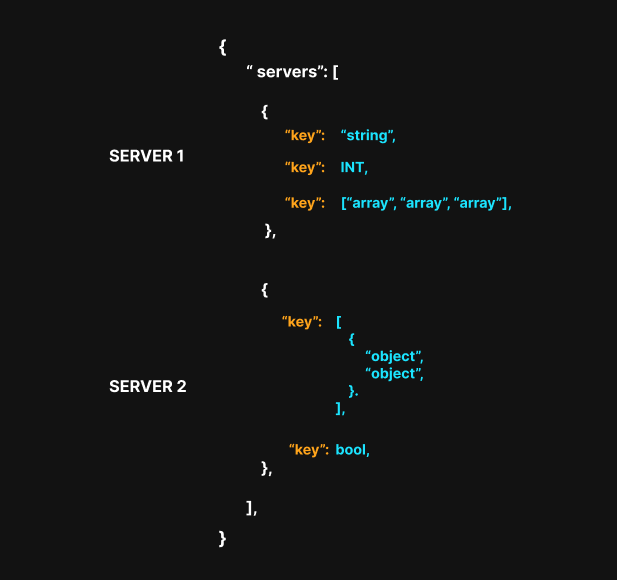
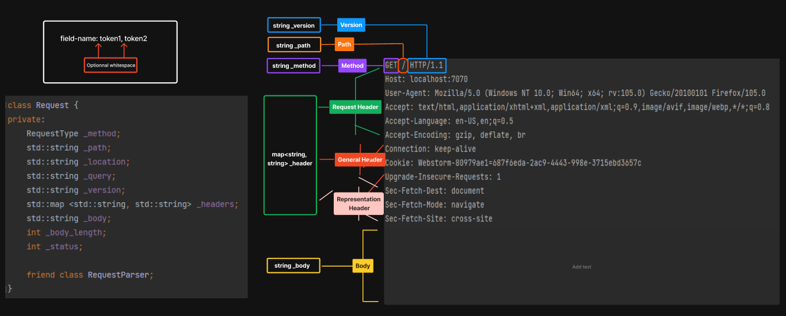
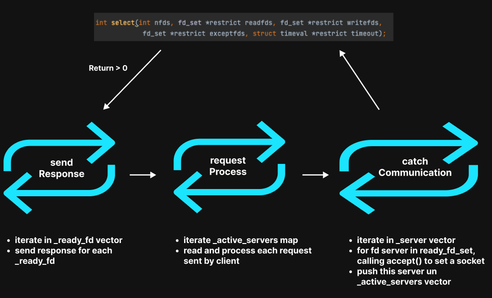
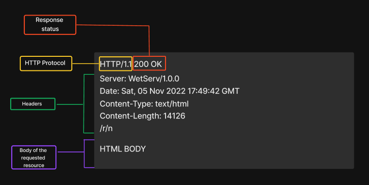
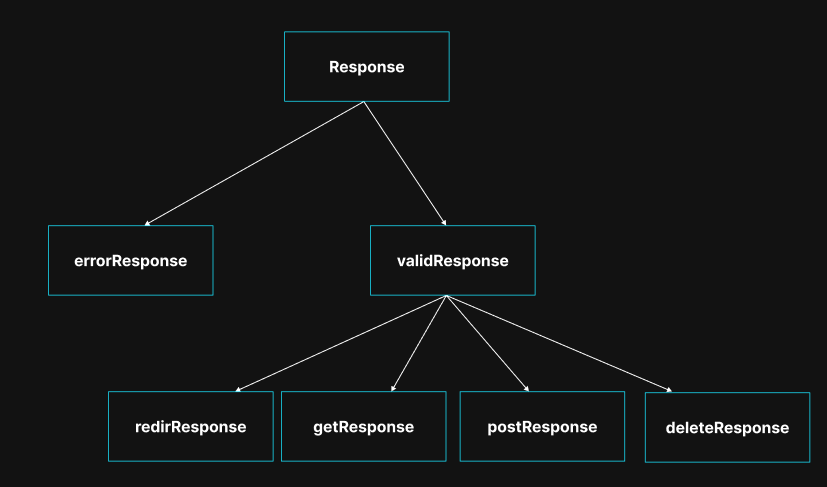
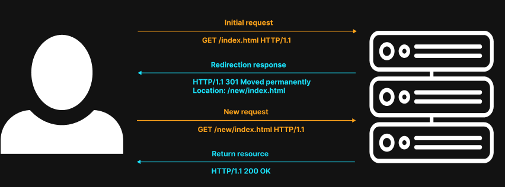
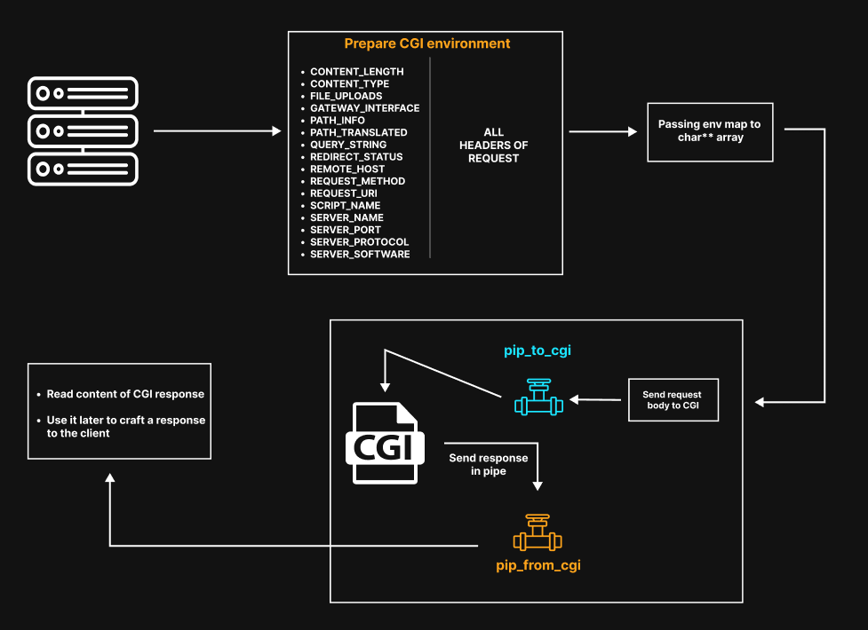

# Webserv CPP98
- [1. Get Started](#get-started)
- [2. Resume](#resume)
- [3. Parsing](#parsing)
  - [3.1 Parse Configuration File](#parse-configuration-file)
    - [3.1.1 Configurations values for Server](#configurations-values-for-server)
    - [3.1.2 Configurations values for Locations](#configurations-values-for-locations)
    - [3.1.3 Configurations values for Redirections](#configurations-values-for-redirections)
  - [3.2 Parse HTTP Request](#parse-http-request)
- [4. Execution](#execution)
  - [4.1 Select()](#select)
  - [4.2 Main Loop](#main-loop)
  - [4.3 Looper Object](#looper-object)
- [5. Response](#response)
  - [5.1 Response Object](#response-object)
- [6. HTTP Methods](#http-methods)
- [7. Redirection](#redirection)
- [8. CGI](#cgi)
  - [8.1 CGI Environment](#cgi-environment)
- [9. RFC Docs](#rfc-docs) 

Made by [Bima](https://github.com/Bima42), [YvanoffP](https://github.com/YvanoffP) and [Tyrossel](https://github.com/tyrossel)

# Get Started
```
make
```

```
./webserv configuration_file
```

- Go to `http://localhost:2022/index.html` for example, and explore it !

<p align="center">
  
</p>

# Resume
<p align="center">
  
</p>

# Parsing
## Parse Configuration File

<p align="center">
  
</p>

- Configuration file must be JSON like
- See how to parse JSON [here](https://www.json.org/json-en.html)

### Configurations values for Server

| Key                  | Type                      | Value                                                               | 
| :--------------      |:-----------------------   |:-----------------------------------------------------------------   |
| address              | STRING                    | IP address on which the server is listening on                      | 
| port                 | INT                       | port on which the server is listening on                            |
| server_name          | STRING or ARRAY           | names used to connect to the server                                 |

### Configurations values for Locations

| Key                  | Type                      | Value                                                               | 
| :--------------      |:-----------------------   |:-----------------------------------------------------------------   |
| root                 | STRING                    | Root path of the server                                             |
| index                | STRING or ARRAY           | names of index files                                                |
| cgi_bin              | STRING                    | path to the cgi exe by default                                      |
| max_client_body_size | INT                       | Max size of body client request                                     |
| auto_index           | BOOL                      | Set the auto_index on or off                                        |
| disabled_methods     | STRING or ARRAY           | Set the disable methods for all server or location                  |
| error_pages          | OBJECT - String:INT ARRAY | path to custom error pages:errors code                              |
| cgi_extensions       | ARRAY                     | Files extensions where CGI will be executed                         |
| locations            | ARRAY of OBJECT           | each location is a mini server, where some configuration can change |
| location_path        | STRING                    | Set the disable methods for all server or location                  |

### Configurations values for Redirections

| Key                  | Type                      | Value                                                               | 
| :--------------      |:-----------------------   |:-----------------------------------------------------------------   |
| redirections         | ARRAY of OBJECT           | each objects contains old_url, status and can have new_url          |
| old_url              | STRING                    | old url you want redirect                                           |
| new_url              | STRING                    | new url who old url will be redirected on                           |
| status               | INT                       | status link to the redirection                                      |

- First part of configuration is server by default == location by default
- Each locations are considered as little server
- Only `address, port and server_names` cannot be redefined in a location
- If a configuration is not present in a location, this configuration key will take the default value in default location

## Parse HTTP Request

- Client request is store in Request object

<p align="center">
  
</p>

- Payload body accepted in our server :
  - classic payload
  - chunked without trailer
  - chunked with trailer
- Here is some docs according to HTTP request format :
  - [RFC 7230](https://www.rfc-editor.org/rfc/rfc7230#section-3.3)
  - [RFC 7231](https://www.rfc-editor.org/rfc/rfc7231#section-5) 

<p align="center">
  
</p>

# Execution

## Select()

<p align="center">
  
</p>

- allow your program to monitor multiple file descriptor (max 1024)
- will be waiting for _timeout_ and return a value :
  - `-1` : error
  - `0` : if timeout
  - `> 0` : total number of bits that are set in readfds, writefds and exceptfds

## Main Loop
- When select() returns a value > 0, 3 others loop are called

<p align="center">
  
</p>

## Looper Object

- Looper is the main object
- He stores all objects required to get the client request, parse it and build a response to him

<p align="center">
  
</p>


# Response
- String, must be sent to the client
- Use the socket to communicate with him
- Response should be write with strict semantic
- 3 parts :
  - `Status line` with HTTP Protocol and Status Code
  - `Headers` with some information about the requested resource
  - `Body` with the content of the requested resource

<p align="center">
  
</p>

- `Content-Length` : must be sent to the client. It indicates to your browser the length exact of the requested resource

## Response Object
<p align="center">
  
</p>

# HTTP Methods

| Method          | Body                     | Resume                                                                                | 
| :-------------- |:-------------------------|:--------------------------------------------------------------------------------------|
| GET             | No                       | Requests a representation of the specified resource                                   |
| POST            | Yes                      | Sends data to the server, sent via an HTML form and results in a change on the server |
| DELETE          | May                      | Deletes the specified resource                                                        |

- [RFC 7231](https://www.rfc-editor.org/rfc/rfc7231)

# Redirection
## Resume
- Technique to give more than one URL address to a page
- It's a special case of response : use the 30X codes
- Client send a request to the server. Server detect that the requested resource has been moved, so server respond the right 30X code. The client will send a new request with the new location to get the requested resource

<p align="center">
  
</p>

## Redirection codes
| Code | Status             | Use case                                                                                            | 
|:-----|:-------------------|:----------------------------------------------------------------------------------------------------|
| 300  | Multiple choice    | Choices are listed in an HTML page in the body. Few use case                                        |
| 301  | Moved Permanently  | Permanent redirection. Reorganization of a Web site                                                 |
| 302  | Found              | Page is temporarily unavailable                                                                     |
| 303  | See Other          | Used to redirect after a PUT or a POST                                                              |
| 304  | Not Modified       | Sent for revalidated conditional requests. Indicates that the cached response is still fresh        |
| 307  | Temporary Redirect | Page is temporarily unavailable for unforeseen reasons. Better than 302 when non-GET method is used |
| 308  | Permanent Redirect | Reorganization of a Web site, with non-GET methods                                                  |

# CGI
- Common Gateway Interface
- Interface that enables servers to execute an extern program
- Use to process user requests, often when user submits a web form that use CGI
- Server will transmit the request to the script, and sent back the CGI response
- Communication between server and CGI will be made using pipe

<p align="center">
  
</p>

- Here is a simple resume of CGI process

<p align="center">
  
</p>

## CGI Environment

| Header            | Value                                                                                     |
|:------------------|:------------------------------------------------------------------------------------------|
| CONTENT_LENGTH    | Length of the request body                                                                |
| CONTENT_TYPE      | Value of Content-Type headers in request                                                  |
| FILE_UPLOADS      | On or Off                                                                                 |
| GATEWAY_INTERFACE | CGI/Version(1.1)                                                                          |
| PATH_INFO         | Full path of the requested file                                                           |
| PATH_TRANSLATED   | Full path of the requested file                                                           |
| QUERY_STRING      | If query, part of request path after '?' / Otherwise, empty string                        |
| REDIRECT_STATUS   | Should be initialize for php-cgi                                                          |
| REMOTE_HOST       | Name of the client that sent the request                                                  |
| REQUEST_METHOD    | Method of the request                                                                     |
| REQUEST_URI       | Full path of the requested file                                                           |
| SCRIPT_NAME       | Name of the cgi file                                                                      |
| SERVER_NAME       | Server hostname, or IP address                                                            |
| SERVER_PORT       | Port where the server i listening                                                         |
| SERVER_PROTOCOL   | Name and revision of the information protcol this request came in with : Protocol/Version |
| SERVER_SOFTWARE   | Name and version of the information server software answering the request : Name/Version  |

# RFC Docs
- RFC are public text use to set the standards of the Internet
- Here is the most useful ones for this project
  - [RFC 7230](https://www.rfc-editor.org/rfc/rfc7230)
  - [RFC 7231](https://www.rfc-editor.org/rfc/rfc7231)
  - [RFC 7232](https://www.rfc-editor.org/rfc/rfc7232)
  - [RFC 7233](https://www.rfc-editor.org/rfc/rfc7233)
  - [RFC 7234](https://www.rfc-editor.org/rfc/rfc7234)
  - [RFC 7235](https://www.rfc-editor.org/rfc/rfc7235)
